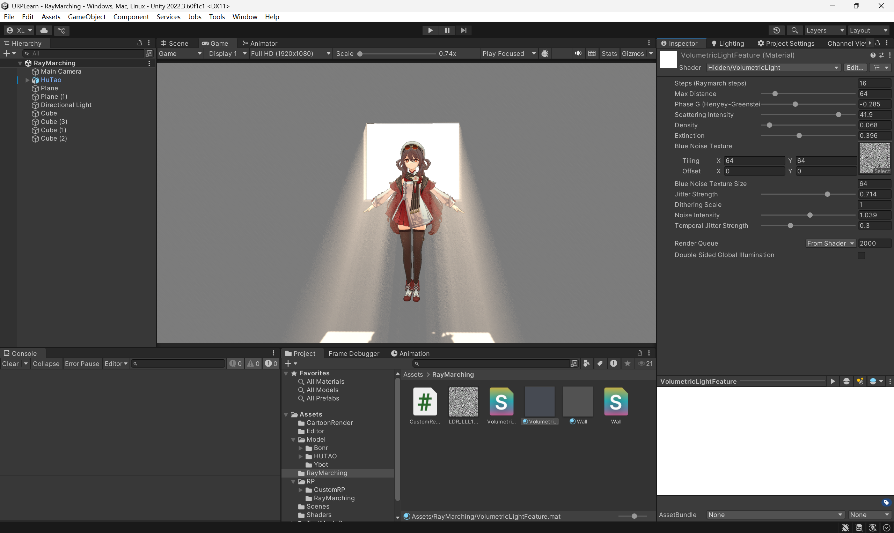

# Unity Ray Marching 体积光渲染

基于Unity URP的高性能Ray Marching体积光渲染实现，适用于游戏级实时渲染。



## 📋 项目简介

本项目实现了一个优化的体积光散射系统，使用Ray Marching算法在Unity URP管线中实现真实的光线在体积雾中的散射效果。适用于游戏场景中的光束、雾效、上帝之光等视觉效果。

## ✨ 核心特性

### 🎯 Ray Marching算法
- **自适应步进**：16-32步的游戏级优化步数
- **Henyey-Greenstein相位函数**：物理正确的光散射模拟
- **Beer-Lambert衰减**：真实的光线吸收和散射
- **早期退出优化**：透明度阈值检测，提升性能

### 🎨 渲染优化
- **Blue Noise抖动**：消除Ray Marching带状伪影
- **Interleaved Gradient Noise**：像素级空间抖动
- **时间抖动**：减少闪烁，平滑帧间变化
- **混合抖动策略**：Blue Noise（时间） + IGN（空间）

### 💡 光照特性
- **实时阴影采样**：体积雾支持主光源阴影
- **多光源支持**：兼容URP多光源系统
- **密度变化**：3D噪声函数生成非均匀雾效
- **可调参数**：散射强度、密度、消光系数等

## 🔧 技术实现

### Ray Marching核心流程

```hlsl
// 伪代码展示算法流程
for (int i = 0; i < steps; i++) {
    // 1. 采样当前位置的密度
    float density = GetDensity(currentPos);
    
    // 2. 采样阴影
    float shadow = GetShadow(currentPos);
    
    // 3. 计算相位函数
    float phase = PhaseHG(viewDir, lightDir);
    
    // 4. 累积散射光
    scatteredLight += lightColor * density * phase * shadow * transmittance;
    
    // 5. 更新透射率（Beer-Lambert定律）
    transmittance *= exp(-extinction * density * stepSize);
    
    // 6. 前进一步
    currentPos += rayDir * stepSize;
}
```

### 抖动优化策略

本实现使用双重抖动策略消除伪影：

1. **Blue Noise时间抖动**
   - 使用R2序列生成低差异采样
   - 控制帧间变化速度，减少闪烁
   - 平铺无缝循环的Blue Noise纹理

2. **IGN空间抖动**
   - 每个像素不同的起始偏移
   - 打破规律性采样模式
   - 隐藏Ray Marching步进伪影

## 📦 项目结构

```
Assets/
├── RayMarching/
│   ├── VolumetricLight.shader          # 体积光Shader
│   ├── CustomRenderPassFeature.cs      # URP渲染Feature
│   ├── VolumetricLightFeature.mat      # 材质
│   ├── Wall.shader                     # PBR物体Shader
│   └── LDR_LLL1_0.png                  # Blue Noise纹理
├── RP/
│   ├── RayMarching/
│   │   ├── URPRayMarching.asset        # URP Asset
│   │   └── URPRayMarching_Renderer.asset  # 渲染器配置
│   └── NormalURP/                       # 标准URP配置
└── Scenes/
    └── RayMarching.unity                # 演示场景
```

## 🚀 使用方法

### 1. 设置URP渲染器

1. 打开 `Assets/RP/RayMarching/URPRayMarching_Renderer.asset`
2. 在 Renderer Features 列表中找到 `Custom Render Pass Feature`
3. 分配 `VolumetricLightFeature` 材质

### 2. 调整参数

在材质面板中可调整以下参数：

#### Ray Marching 参数
- **Steps**: 步进数量（16-32，越高越精确但性能越低）
- **Max Distance**: 最大追踪距离
- **Phase G**: 相位函数参数（-0.99到0.99，控制前向/后向散射）

#### 散射属性
- **Scattering Intensity**: 散射强度（0-50）
- **Density**: 雾密度（0-1）
- **Extinction**: 消光系数（0-1）

#### 抖动优化
- **Blue Noise Texture**: Blue Noise纹理
- **Jitter Strength**: 抖动强度（0-1）
- **Temporal Strength**: 时间抖动强度（0-1，越低越稳定）
- **Noise Intensity**: 噪声强度（0-2）

### 3. 场景配置

- 确保场景中有**Directional Light**作为主光源
- 在URP Asset中启用**Depth Texture**
- 在Light组件中启用**Shadows**

## 🎮 性能优化

本实现针对游戏级实时渲染进行了多项优化：

1. **步数控制**：推荐使用16-32步，在质量和性能间平衡
2. **早期退出**：透明度<0.01时终止追踪
3. **采样抖动**：用抖动换取更少的采样步数
4. **距离限制**：设置合理的Max Distance避免远处浪费
5. **密度优化**：使用简化的噪声函数，避免复杂计算

## 📊 性能表现

在1080p分辨率下的性能参考（GTX 1660 Ti）：

| 步数 | 帧率 | 备注 |
|------|------|------|
| 16   | ~60fps | 推荐移动端 |
| 32   | ~45fps | PC推荐配置 |
| 64   | ~25fps | 高质量截图 |

## 🎓 技术参考

- [GPU Gems 7 - Real-Time Volumetric Cloudscapes](https://www.guerrilla-games.com/read/nubis-realtime-volumetric-cloudscapes)
- [Physically Based Sky, Atmosphere and Cloud Rendering](https://sebh.github.io/publications/egsr2020.pdf)
- [Interleaved Gradient Noise](http://www.iryoku.com/next-generation-post-processing-in-call-of-duty-advanced-warfare)

## 📝 其他功能

本项目还包含其他URP学习内容：

- **卡通渲染**：基础Toon Shading实现
- **自定义渲染管线**：Custom SRP示例
- **PBR材质**：带描边的PBR Shader

## 📄 许可证

MIT License - 可自由用于学习和商业项目

## 👤 作者

Sirius-Lucien

---

⭐ 如果这个项目对你有帮助，欢迎Star！
